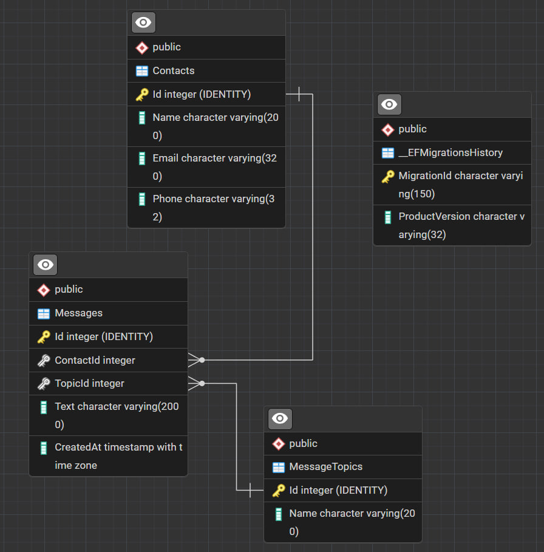

# SofTrust Feedback App

Простое приложение «форма обратной связи».  
Стек: ASP.NET Core 8 Web API, PostgreSQL, Angular 20, TailwindCSS, reCAPTCHA v2.

## Быстрый запуск
### Backend (`./backend`)
1. Настроить `appsettings.json` (строка подключения + `Recaptcha:SecretKey`, при необходимости поправить `Cors:Origins`).
2. Применить миграции и сиды:
   ```bash
   dotnet restore
   dotnet ef database update
   ```
3. Запустить API:
   ```bash
   dotnet run --launch-profile http
   ```
   Swagger будет на `http://localhost:5000/swagger`.

### Frontend (`./frontend`)
1. Указать API URL и `recaptchaSiteKey` в `src/environments/environment*.ts`.
2. Поставить зависимости и стартовать дев-сервер:
   ```bash
   npm install
   npm start
   ```
   Интерфейс: `http://localhost:4200`.
3. Сборка:
   ```bash
   npm run build
   ```
   Результат в `dist/frontend`.

### Docker
1. Сделать `.env` из `.env.example` и заполнить значения (пароли, ключ reCAPTCHA).
2. Поднять всё:
   ```bash
   docker compose up --build
   ```
   Поднимутся три контейнера: `postgres` (5432), `backend` (5000), `frontend` (4200).
3. Остановить:
   ```bash
   docker compose down
   ```
   Данные Postgres лежат в volume `postgres_data`.

## Полезные команды
- `dotnet ef database update` - накатить миграции
- `dotnet ef migrations remove` - откатить последнюю миграцию
- `dotnet run --launch-profile http` - запустить API
- `npm start` - dev-сервер Angular
- `npm run build` - production сборка фронта

## ER-диаграмма и таблицы


- `message_topics` - справочник тем сообщений
- `messages` - сообщения (ссылки на тему и контакт)
- `contacts` - отправители (имя, email, телефон)
